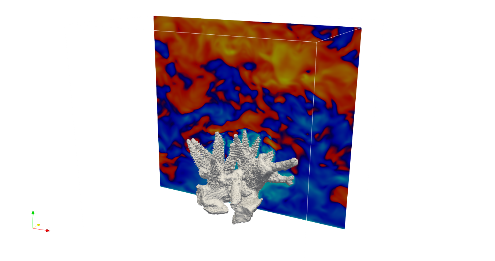
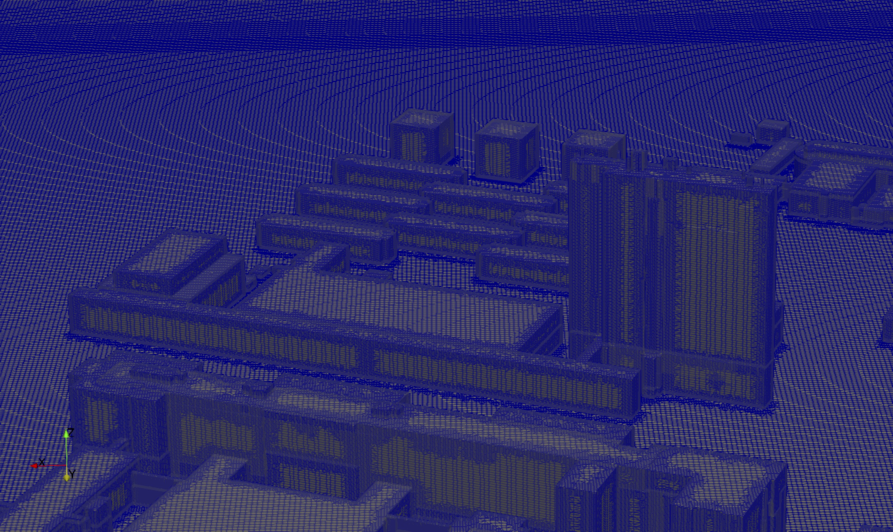
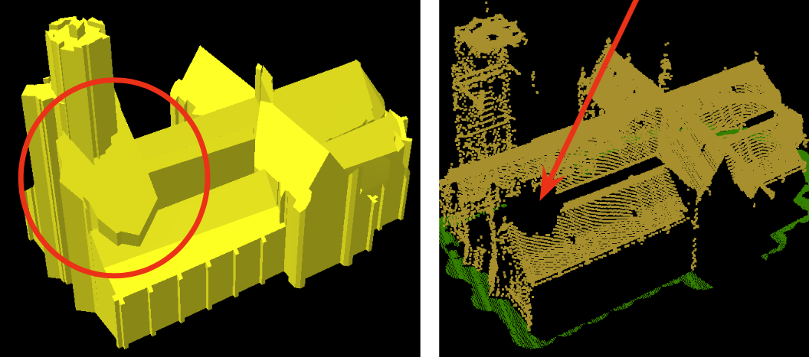
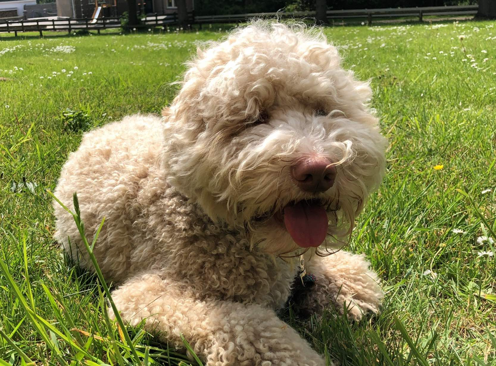
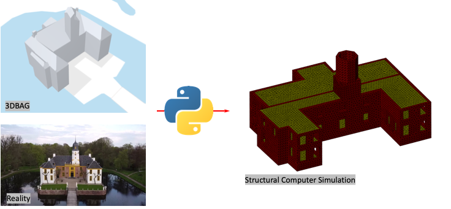
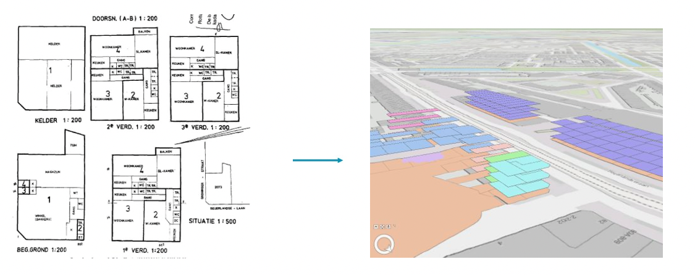
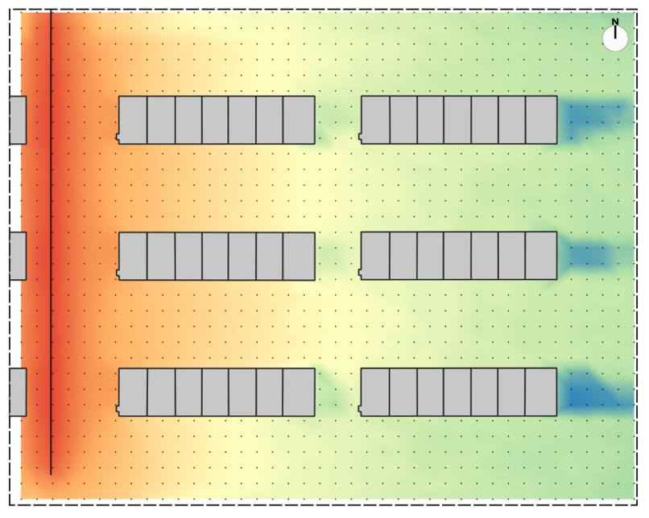
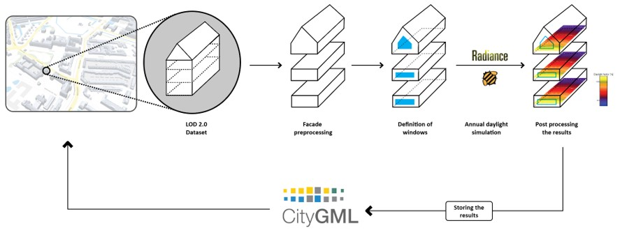
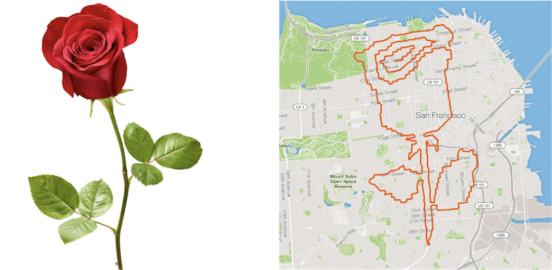
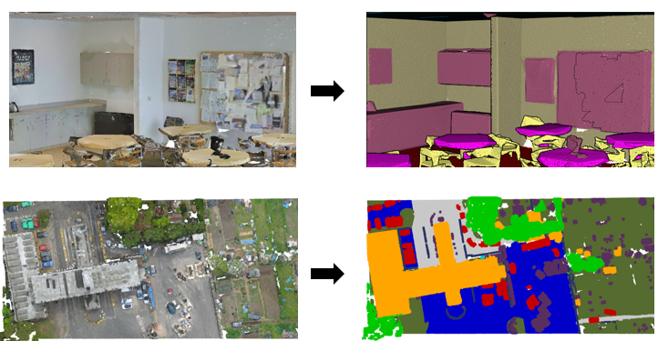

  <b>Heads up!</b> Theses done in our group should follow the <a href="https://3d.bk.tudelft.nl/courses/geo2020/openscience/">requirements for open science</a>.

- - -

* Table of Content
{:toc}

- - -

## Investigating Predictive Modeling for Land Use Planning and Management 

This graduation project focuses on predictive modelling and its role in land use planning and management. This project aims to provide valuable insights into future land use planning by exploring various factors that influence land use change and evaluating the effectiveness of different modelling approaches. In this MSc thesis, you will delve into the physical, environmental, and socio-economic factors that shape land use patterns. By analysing the impacts of land use policies, you will contribute to the foundation of effective decision-making processes in sustainable land management.

Key objectives of this project include, among others:

1.	Identifying the factors that significantly influence land use change: You will investigate a range of physical, environmental, and socio-economic factors and their relationship with land use dynamics making as much as possible use of open data. This analysis will contribute to understanding the underlying drivers of land use change.
2.	Evaluating different modelling approaches: Considering the varying scale and resolution of land use and other spatial data, you will explore and compare different modelling techniques. This analysis will help identify the most suitable algorithms for specific land use tasks.
3.	Assessing the performance of predictive algorithms: By comparing the performance of different algorithms, you will assess their accuracy, efficiency, and applicability to land use prediction. This evaluation will provide insights into the strengths and limitations of each approach.
   
Prerequisites: QGIS, Proficiency in programming languages such as R or Python and knowledge of machine learning concepts.

**Contact:** [Daniele Cannatella](https://3d.bk.tudelft.nl/dcannatella/)

- - -

## Designing a Nature-Based Solutions Planning Support System

This project aims to develop an innovative tool that facilitates the integration and implementation of nature-based solutions in urban planning processes. In this MSc thesis, you will delve into the field of nature-based solutions, which involve using nature-inspired approaches to address various environmental challenges while providing social and economic benefits. Your objective will be to design a planning support system that enables decision-makers and stakeholders to identify, evaluate, and prioritize nature-based solutions for different contexts.

Key objectives of this project include, among others:

1.	Literature review and best practices analysis: You will conduct an in-depth review of existing literature and case studies related to nature-based solutions. By analysing successful examples, you will identify key design principles and considerations for the planning support system.
2.	System architecture and interface design: Based on the identified design principles, you will develop a conceptual architecture and user-friendly interface for the planning support system. This system should facilitate data integration, analysis, visualization, and decision-making related to nature-based solutions.
3.	Integration of spatial and non-spatial data: You will explore methods for integrating diverse data types, including spatial data (e.g., land cover, ecosystem services) and non-spatial data (e.g., socio-economic indicators, climate data). The system should enable data-driven analysis and decision-making processes.
Prototype development and evaluation: Using appropriate software tools, you will develop a functional prototype of the planning support system. You will then evaluate its usability, functionality, and effectiveness through user feedback and case study applications.

Prerequisites: Proficiency in GIS and software development (e.g., QGIS, R, Python) and understanding of nature-based solutions and urban/landscape planning.

**Contact:** [Daniele Cannatella](https://3d.bk.tudelft.nl/dcannatella/)

- - -

## Adding support for CityGML 3.0 to the 3DCityDB-Tools plugin for QGIS

The [3DCityDB-Tools](https://github.com/tudelft3d/3DCityDB-Tools-for-QGIS) plugin for QGIS allows to conveniently use CityGML/CitySON data stored in the free and open-source [3D City Database](https://www.3dcitydb.org/3dcitydb/) (3DCityDB). It currently supports the 3DCityDB 4.x. The next 3DCityDB v. 5.0 will introduce support CityGML 3.0. 
The scope of this thesis is to extend to QGIS plugin in order to add support for the new version of the 3DCityDB, thus facilitating user's interaction with geodata adhering to the CityGML 3.0 standard. 

{:width="800px"}

The thesis is a collaboration between the 3DGeoinformation group and [virtualcitysystem GmbH](https://vc.systems/en/) in Germany. Attendance of elective course [GEO5014](https://studiegids.tudelft.nl/a101_displayCourse.do?course_id=60400) in Q5 (September 2023) is suggesged, as relevant topics needed for this thesis will be covered.

You will programm in Python and in PL/pgSQL.
Before picking the topic, please contact us!

**Contact:** [Giorgio Agugiaro](https://3d.bk.tudelft.nl/gagugiaro/)

- - -

## Adding support for CitySim to the 3DCityDB-Tools plugin for QGIS

[CitySim](http://www.kaemco.ch/download.php) is an open-source simulation software to perform different energy simulations for buildings/districts (e.g. space heating energy demand, solar irradiation, urban heat islands). The [3DCityDB-Tools](https://github.com/tudelft3d/3DCityDB-Tools-for-QGIS) plugin for QGIS allows to conveniently use CityGML/CityJSON data stored in the free and open-source [3D City Database](https://www.3dcitydb.org/3dcitydb/) (3DCityDB).
The scope of this thesis is to extend to QGIS plugin in order to allow for data preparation, run CitySim's energy simulations, collect and analyse of the simulation results from within QGIS by developing a GUI dialog and extending a bidirectional interface between the two software packages. A python-based first prototype of the interface was already partially developed in a [thesis completed in June 2022](http://resolver.tudelft.nl/uuid:3ae123bd-cae4-45b2-be48-27ffe5cab980). The ultimate goal is to allow for a seamless flow of information and to perform energy simulations in CitySim exploting the added value of a semantic 3D city model encoded using the CityGML data model.

{:width="800px"}

The thesis is a collaboration between the 3DGeoinformation group and the [Idiap Research Institute](https://www.idiap.ch/en/scientific-research/energy-informatics/index_html) in Switzerland. Attendance of elective course [GEO5014](https://studiegids.tudelft.nl/a101_displayCourse.do?course_id=60400) in Q5 (September 2023) is highly recommended, as many relevant topics needed for this thesis will be covered.

You will programm in Python and in PL/pgSQL.
Before picking the topic, please contact us!

**Contact:** [Giorgio Agugiaro](https://3d.bk.tudelft.nl/gagugiaro/)

- - -

## Text Guided 3D Editting of Architectural Models

Architecture is a complex field that requires a lot of effort and time to create detailed models that can be used for planning and visualization. Editing the geometry of such models can be a time-consuming and challenging task. The emergence of modern generative AI methods has opened up new possibilities in the field of architecture. The use of AI tools can enable architects and designers to make changes quickly and efficiently. However, the use of AI methods in the field of architecture is still in its infancy. The proposed project aims to explore the potential of modern generative AI methods in the field of architecture by developing a tool that can perform geometry editing using text prompts. The project will leverage the power of Clip, Diffusion, and MVS/NeRF/Neural Rendering to create a text-guided geometry/radiance/implicit fields editing tool. The tool will be tested on built scenes and/or architectural models to enable it to make changes to the model based on text prompts accurately. The resulting source code will be made available open source to maximize the educational value.

The aim of the project is to explore the idea that may allow strong geometrical changes to be made to architectural models with ease, including changing window shapes, roof shapes, and structural styles such as ancient roman or Parthenon. The project aims to develop a text-guided geometry/radiance fields editing tool that can be used to make significant changes to architectural/built models conditioned on the text prompts.

{:width="800px"}

Before contacting, please refer to this [link](https://drive.google.com/file/d/1AekjE8v41nRjfj1UoXd4OcqXzROCLoas/view) for more details if you are considering.

**Contact:** [Nail Ibrahimli](https://3d.bk.tudelft.nl/nibrahimli/)

- - -

## Enhancing 3D City Models with Neural Representations
The availability of high-resolution aerial images and point clouds has revolutionized the creation of 3D city models. However, these models often suffer from noise and lack fine geometric details that are clearly visible in the images. This project proposes a novel approach to address this limitation by avoiding premature reduction of the triangulated 3D point cloud into a height field or surface mesh. Instead, student will propose a neural representation of the 3D city model as an implicit, continuous occupancy field, utilizing learned multi-modal embeddings of the point cloud and ortho-photos/nadir views.

The main objective of this project is to demonstrate that this neural representation enables the extraction of high-quality Digital Surface Models (DSMs) with accurate building reconstruction. The reconstructed models will capture intricate roof details, exhibit smooth surfaces. Additionally, student will leverage segmentation tools to explore the potential of extracting local information from image embeddings. Moreover, student will aim to learn local geometric priors from point clouds to enhance point cloud completeness and enable fine-grained DSM reconstruction.

By adopting this innovative approach, we anticipate significant improvements in the quality of 3D city models, providing more detailed and accurate representations of urban environments. The results obtained from this project will contribute to advancements in urban planning, architecture, and various applications requiring precise 3D city models.

### **Goal**
The goal of the project is to develop a novel approach for enhancing the quality of 3D city models by utilizing neural representations and multi-modal embeddings. The project aims to demonstrate that this approach enables the extraction of high-quality Digital Surface Models (DSMs) with accurate building reconstruction, capturing intricate details, smooth surfaces. Additionally, the project seeks to explore the extraction of local information from image embeddings and learn geometric priors from point clouds to improve point cloud completeness and fine-grained DSM reconstruction.

  

Before contacting us, please refer to this [link](https://drive.google.com/file/d/1dgsqIuxNvuWPBWCYpBgnJ5JXSYNnbamP/view) for more details if you are considering.

**Contact:** [Nail Ibrahimli](https://3d.bk.tudelft.nl/nibrahimli/), [Ken Arroyo Ohori](http://3d.bk.tudelft.nl/ken)

- - -

## Coral Reef Complexity

Corals [cnidarians] provide a safe and nutrient-rich environment for various aquatic organisms to coexist, significantly enhancing local biodiversity. However, global coral reef health has been in decline over the past few decades due to increased ocean acidification. Consequently, there is a growing scientific interest in understanding the life cycle of corals. One aspect of coral reefs is the connection between coral reef complexity and coral health. From a hydrodynamic perspective, there is growing evidence that the coral complexity [i.e., fractal dimension] acts to increase the mass transfer rate that enables the growth of coral communities; both isolated coral reefs, and collective communities (Monismith, 2006).

In this MSc thesis you will work on spatially characterising the coral reef communities using  urban geoinformation tools to provide conventional metrics such as clustering, dimension, roughness, etc. These metrics can be used to understand any correlations between the health of the coral reef and the spatial characteristics. Additionally, characterising the spatial features of coral reefs can enable flow simulations to better understand the hydrodynamics as shown in the figure below. The thesis will broadly consist of the following three steps:

- Literature review: A thorough literature survey to understand the state of the art for characterising coral reef complexity and its connection to coral health.
- Data curation: Database search for coral reef point clouds (yes, we scan corals!) that are freely available. A good starting point would be USGS [https://cmgds.marine.usgs.gov/data-releases/datarelease/10.5066-P93RIIG9/], The Smithsonians digitisation collection [https://3d.si.edu/corals].
- Algorithm development: Develop independent morphology algorithms to characterise individual coral and coral reefs similar to urban planning metrics. A good starting point would be the metrics you implemented for GEO1004, Homework 02.  e.g., EUBUCCO [https://github.com/ai4up/eubucco], 3D-Building metrics [https://github.com/tudelft3d/3d-building-metrics] 

Skills required: Python programming and GEO1004

{:width="800px"}

**Contact:** [Akshay Patil](https://3d.bk.tudelft.nl/apatil/), [Hugo Ledoux](https://3d.bk.tudelft.nl/hledoux/)

- - -

## Visualizing tiled 3D data on the web

Vector-based maps, like the open-source [MapLibre](https://maplibre.org), have been established as the de-facto standard in the industry for world-wide map data visualization.
There is a robust toolchain for creating, styling and visualizing 2D data (through vector tiles) but no standardized way to do so in 3D.

In this MSc thesis you will investigate the possibility of integrating (true) 3D data in MapLibre, by potentially integrating an existing open standard like 3D Tiles to MapLibre GL JS.
The topic can be focused to either the data processing and management part (evaluating different standards, developing a solution to create tiled sources of 3D data) or the visualization part (extending MapLibre GL JS to incorporate some existing format, like 3D tiles).

Knowledge of programming in either Python (for data processing) or JavaScript/TypeScript (preferably with WebGL or three.js) is required for this thesis.

**Contact:** [Stelios Vitalis](https://3d.bk.tudelft.nl/svitalis), [Ken Arroyo Ohori](https://ken.mx)

This thesis is in collaboration with TomTom.

{:width="800px"}

- - -

## The effects of building model automatic reconstruction methods for CFD simulations

The digitalization of the architecture and the build environment means that there is a new wealth of digital data that can help generate city scale models. However, not all these sources allow for models to be created of the same quality. The effects of different quality or alternatively abstracted models on CFD has been sparsely evaluated. Even more rare is the evaluation of models that fall outside of the established LoD frameworks e.g., voxelated and marching cubed models.
 
In this thesis these different models and their effects on CFD simulations will be evaluated. Based on these results it might be possible to do suggestions or set up rules to describe viable models that can be used for CFD processing. Extensions to other parts of City analysis could be made as well if desired.

If you choose this topic you can expect to work with building models, voxelization and computational fluid dynamic simulations performed with OpenFOAM. 

{:width="800px"}

**Contact:** [Clara Garcia-Sanchez](https://3d.bk.tudelft.nl/gsclara), [Jasper van der Vaart](https://3d.bk.tudelft.nl/jvdvaart/)

- - -

## Linking Urban Heat Island effects with 3D urban morphology

With the increase in urbanization and gentifrication the Urban Heat Island (UHI) effect is becoming a priority concern for many cities and municipalities. As such several studies have been recently published linking urban morphology and plausible UHI remedies such as green roofs, for example. 

In this MSc thesis we will combine for the first time three sources of data: landsat imagery, city measurements for air temperature and the results from a brand new open-source tool that automatically computes Global Building Morphology Indicators (GBMI). The first goal of the project is to link temperature data and GBMI results and analyse the sensitivity of the different indicators to UHI scenarios in Amsterdam city. The second goal would be to generalize the tool application to other cities with diverse morphology to further analyze its predictability capabilities in relation to UHI effects and potential solutions.

If you choose this topic, you can expect to learn about UHI and urban morphology analysis. Programming experience and interest is an advantage for this topic. Your work might require to implement source code for the analysis of the set-ups (in C++ or Python or any other language you prefer).

{:width="800px"}

**Contact:** [Clara Garcia-Sanchez](https://3d.bk.tudelft.nl/gsclara), [Lukas Beuster](https://3d.bk.tudelft.nl/lbeuster/)

- - -

## Development on quality assessment of point cloud datasets
Rijkswaterstaat is transitioning into a data-driven organization, with 3D point cloud data playing a crucial role in the work processes and digital twin vision.The effectiveness of the current research project, which focuses on merging different 3D point clouds into the Integrated Heightdataset of the Netherlands (IHN), relies on the validation process as a key component. Therefore the focus of this MSc thesis is to research the possibilities for validating the quality of point clouds received from large infrastructure projects like the Moerdijkbridge zone or tunnels in the area of Rotterdam. If you choose this topic, you will have the opportunity to work for the Department of Advice and Validation of Geodata at Rijkswaterstaat, with access to numerous amount of elevation data products and the opportunity to contribute to the digital twin & IHN research projects.

Programming experience and interest is an advantages for this topic. Your work might require to implement source code for the analysis on different large point clouds (in C++, Python or any other language you prefer).

{:width="800px"}

**Contact:** [Daan van der Heide](https://3d.bk.tudelft.nl/dvdheide/),  [Jantien Stoter](https://3d.bk.tudelft.nl/jstoter/)

- - -

## Coupled and decoupled simulations of urban wind flow for indoor natural ventilation modelling

Urban wind flow is an important factor in the efficiency of the indoor natural ventilation, which is becoming a really essential ventilation strategy under the current pandemic life environment.
To model natural ventilation in buildings, running Computational Fluid Dynamics (CFD) simulations is not so straightforward because two levels of wind flow are present in the computational domain.
Researchers usually rely on decoupled simulations of urban wind flow and indoor ventilation.
This means that the urban wind flow is modelled first and then relevant values near the openings of the studied building are used to later model the indoor ventilation.
However, recently with the increase of computational power, there is a rise in the use of coupled simulations where outdoor and indoor air are modelled together.

{:width="800px"}

In this MSc thesis, we will try to compare the results of the two approaches and try to validate them with an existing case study. The results could show us if there is a need for a more computationally expensive coupled simulation, or if there are available approaches that allow us to represent accurately outdoor conditions by just imposing appropriate boundary conditions. If you choose this topic, you can expect to learn about indoor ventilation, the level of detail needed in the urban area surrounding the building of interest, and validation CFD simulations. Programming experience and interest is an advantage for this topic. Your work will require to implement source code for the analysis of the set-ups (in C++ or Python or any other language you prefer).

**Contact:** [Clara Garcia-Sanchez](https://3d.bk.tudelft.nl/gsclara), [Nadine Hobeika](https://3d.bk.tudelft.nl/nhobeika/)

- - -

## Using urban morphology to optimize biking and running routes in cities?

RIVM monitoring tool [NSL tool](https://www.nsl-monitoring.nl/), provides information regarding air pollution in streets for the most areas in the Netherlands. The tool uses urban morphology along other parameters to estimate local air quality. 

{:width="400px"}

Within this MSc thesis we will exploit urban morphologies and NSL monitoring to optimize running and biking paths within Netherlands urban areas. For that open source tools such as [momepy](http://docs.momepy.org/en/stable/), and previously developed approaches such as [de Jongh thesis](http://resolver.tudelft.nl/uuid:fdbff288-fede-4796-9972-54627af0db77) (see image attached) will be explored. 

**Contact:** [Clara Garcia-Sanchez](https://3d.bk.tudelft.nl/gsclara), [Hugo Ledoux](https://3d.bk.tudelft.nl/hledoux/)

- - -

## Predicting pedestrian wind comfort and thermal comfort with Large-Eddy Simulations in uDALES

Pedestrian wind and thermal comfort still remain an important topic in the development of future urban scenarios. Considering the current climate change conditions, with increased frequency in heat waves and extreme weather events, the way we design our cities can further impact their resilience and comfort. Computational fluid dynamics (CFD) approaches can help us improving and adapting future and current urban designs to maximize sustainability and comfort. To maximize the predictability capabilities approaches such as Large-Eddy Simulations [LES](https://en.wikipedia.org/wiki/Large_eddy_simulation) can be used to resolve most of the urban scales and model uniquely the small scales. 

{:width="400px"}

Within this MSc thesis we will exploit the capabilities of open-source tools such as [uDALES](https://github.com/uDALES/u-dales) to predict wind and thermal comfort in real urban scenarios. The initial set-up focuses on using part of the Clementi neighbourhood in Singapore, which was already set-up by previous MSc thesis to run RANS simulations in [Opsomer](https://repository.tudelft.nl/islandora/object/uuid%3A97304da6-8938-48eb-8117-ca53321b1e34?collection=education). Considering the demanding computational capabilities required by LES, this area can be potentially reduced, or other test cases can be also explored. Attendance of elective course [GEO5015](https://studiegids.tudelft.nl/a101_displayCourse.do?course_id=57094) in Q4 or similar CFD knowledge is required. 

**Contact:** [Clara Garcia-Sanchez](http://3d.bk.tudelft.nl/gsclara), [Ivan Pađen](http://3d.bk.tudelft.nl/ipaden)

- - -

## Heating energy demand of the Dutch building stock with the help of the 3D BAG 2.0

The [3D BAG 2.0](https://3dbag.nl/en/viewer), a dataset containing LoD2 geometries of buildings of the whole Netherlands, has been recently released by the 3D Geoinformation group. The scope of this thesis is to test the suitability of the 3D BAG to estimate the energy demand of residential buildings. In this thesis, the energy demand computation will be based on the quasi-static energy-balance method and will implemement a Python-based subset of the specifications defined by the recently introduced Dutch norm [NTA8800](https://www.gebouwenergieprestatie.nl/).

{:width="800px"}

The thesis is a collaboration between the 3DGeoinformation group and the [Building Energy Epidemiology](https://www.tudelft.nl/bk/over-faculteit/afdelingen/management-in-the-built-environment/organisatie/leerstoelen/building-energy-epidemiology) group at TU Delft. Attendance of elective course [GEO5014](https://studiegids.tudelft.nl/a101_displayCourse.do?course_id=60400) in Q5 (September 2022) is highly recommended, as many relevant topics needed for this thesis will be covered.

You will programm in Python and (a bit) in PL/pgSQL.
Before picking the topic, please contact us!

**Contact:** [Giorgio Agugiaro](https://3d.bk.tudelft.nl/gagugiaro/) (3D Geoinformation Group)

- - -

## Optimizing building mesh designs for computational fluid dynamics using machine learning 

Since one of the major burdens when performing computational fluid dynamic simulations (CFD) is to set up a good mesh, improving the current capabilities to mesh automatically complex geometries would have a large impact for the computational fluid dynamics community. This task becomes really essential when geometries are complex, such as high resolution level of detail buildings, and severals hundreds of simulations need to be run to quantify uncertainties.  

In this MSc thesis we will apply the automatic meshers available in OpenFOAM (SnappyHexMesh and cfMesh) and combined them with machine learning techniques to improve current mesh set-ups. We will start by simplified geometries with low level of detail, and increase progressively details. The results can potentially help us reducing the amount of time spent designing our city mesh, and thus allow us to perform faster analysis.   

If you work on this topic, you can expect to learn about mesh generation aligned with CFD best practice guidelines, set-ups and flow simulations. Programming experience and interest is an advantage for this topic. Your work will require to implement source code for the analysis of the set-ups (in C++ or Python). 

{:width="400px"}

**Contact:** [Clara García-Sánchez](http://3d.bk.tudelft.nl/gsclara) and [Ivan Pađen](http://3d.bk.tudelft.nl/ipaden)

- - -

## To mesh or not to mesh: immersed boundary methods and porosity in OpenFOAM

One of the major burdens when performing computational fluid dynamic simulations (CFD) is to set up a good mesh. This task becomes really time consuming when geometries are complex, such as high resolution buildings. There are a few strategies to avoid the usage of an explicit mesh, but using immersed boundary methods or porosity definitions which in a very general description allow to construct regular meshes and represent the buildings through forces. 

In this MSc thesis we will apply the already developed immersed boundary method in OpenFOAM-extended and compare it with a porosity approach through several standarzied CFD study cases. The results can potentially help us reducing the number of buildings to be mesh explicitely, and therefore the amount of time spent designing our city mesh.  

If you work on this topic, you can expect to learn about CFD best practice guidelines, set-ups and flow simulations. You will also work with real experimental wind and turbulence data recorded in wind tunnels. Programming experience and interest is an advantage for this topic. Your work will require to implement source code for the analysis of the set-ups (in C++ or Python). 

{:width="800px"}

**Contact:** [Clara García-Sánchez](http://3d.bk.tudelft.nl/gsclara) and [Ivan Pađen](http://3d.bk.tudelft.nl/ipaden).

- - -

## Semantically enriching the 3D BAG

{:width="400px"}

With the 3D BAG we have LoD2.2 building models for the whole of the Netherlands. Unfortunately the semantics of these models is still very simplistic (only a very basic classification of wall/roof/floor surfaces is present). The goal of this project would be to develop an automatic method to semantically enrich these models by labeling rooftop structures such as chimneys, A/C units and dormers and/or detecting facade elements such as doors and and windows. This is to be achieved by analysing the geometry of the existing 3D BAG models, the source point cloud and/or (oblique) aerial photographs.

Programming required in python/C++.

**Contact:** [Ravi Peters](http://tudelft.nl/rypeters)

- - -

## 3D Cadastre

{:width="700px"}

Since more than 15 years, lots of studies have been done on 3D Cadastre to register multilevel ownership in a transparent and proper way.
In 2016, we realised the first 3D cadastral situation [3D cadastral registration]( https://3d.bk.tudelft.nl/news/2016/03/21/3DKadaster.html) in the Netherlands.
However, there is still a gap between research and practice. In this research you will analyse how a Level of Detail Framework, that defines specifc solutions for specific 3d cadatsre problems may help to close the 3D cadastre research-to-practice gap.
The idea is explained in [this](https://www.fig.net/resources/proceedings/fig_proceedings/fig2020/papers/ts04e/TS04E_stoter_ho_et_al_10503.pdf) short paper

*Contact:* [Jantien](http://3d.bk.tudelft.nl/jstoter) 

- - -

## Integrated modelling of utility networks in the urban environment

In the framework of Smart Cities, the MSc thesis will focus on interoperability issues when it comes the heterogeneous utility networks (e.g. gas, water, electricity, sewage, district heating, telecommunications, etc.) that are found in the urban environment.
Starting from a CityGML-based 3D city model, the Msc. thesis will focus on testing the Utility Network ADE (Application Domain Extension) and compare it to existing or newly proposed standards (IMKL or MUDDI), based on a concrete case study which will be agreed upon with the student. 
The image shown here is taken from a previous [thesis](https://repository.tudelft.nl/islandora/object/uuid:fed24b16-cf95-4fa0-a109-ece6e91b61e9?collection=education) and serves as example - and starting point - of the overall topic of the thesis proposed here.

**Contacts**: [Giorgio Agugiaro](https://3d.bk.tudelft.nl/gagugiaro/) and [Jantien Stoter](https://3d.bk.tudelft.nl/jstoter/)

- - -

## Performance and robustness of software libraries for computational geometry

{:width="500px"}

Software libraries for computational geometry underpin a lot of our research, but an in-depth comparison of how these different software libraries behave in terms of performance and robustness is not available. For example, the feasability of multi-disciplinary use of geometry in BIM/GIS integration and automated thermal analysis of IFC building models is largely shaped by the characteristics of the algorithmns offered in open source libraries such as CGAL and Open CASCADE. This research project is an opportunity to publish something novel, useful and relevant to many disciplines.

*Contact:* [Thomas Krijnen](mail@thomaskrijnen.com)

- - - 

## Something with streaming TINs for massive datasets

{:width="300px"}

The AHN3 dataset contains a lot of points (600+ billions), and while these are useful on their own, some applications would benefit from having a TIN, isocontours, objects extracted from them, etc.

You learned in GEO1015 how to create a Delaunay TIN, and for massive ones the theory about [streaming geometries](https://www.cs.unc.edu/~isenburg/papers/ilss-scdt-06.pdf) was explained.

The aim of this project is to extend the work already done ([sst](https://github.com/hugoledoux/sst/) + one [MSc thesis about simplification](http://resolver.tudelft.nl/uuid:e7df1d5a-8819-40aa-a3d1-1f6d50b8a39e)) and to add new operators useful for practitioners.
Exactly what I am not sure yet, but if you like the challenge of dealing with several billions of points, then we can find a good topic. The main ones are creating grids with interpolation and isolines extraction.

*Contact:* [Hugo Ledoux](https://3d.bk.tudelft.nl/hledoux)

- - - 

## Filling the gaps in aerial point clouds with deep learning

{:width="500px"}

Because of the way they are collected, aerial point cloud datasets acquired with lidar often contain areas with no measurements due to occlusion effects.
This occurs for building façades and other vertical surfaces (e.g., in dormers), but also other surfaces next to tall structures such as a church tower (see right part image above).
The gaps in the datasets are problematic for the processing of point cloud, for instance automatic reconstruction algorithms can fail or output 3D models with several artefacts (see left part image above).

The aim of this research project is to design and implement methods to complete aerial point clouds datasets such as the AHN3 dataset (that is fill those gaps).
The idea is to investigate how new developments in deep learning (specifically [DeepSDF](https://github.com/facebookresearch/DeepSDF), and [ShapeInversion](https://junzhezhang.github.io/projects/ShapeInversion/)) and to adapt it to aerial point clouds.
The focus would be in the first place on buildings, so that their regularity and verticality could be exploited.

The student would be expected to take a machine learning and/or deep learning course as elective.

*Contact:* [Hugo Ledoux](https://3d.bk.tudelft.nl/hledoux) + [Ravi Peters](http://tudelft.nl/rypeters) + [Weixiao Gao](https://3d.bk.tudelft.nl/weixiao/)

- - - 

## Developing methods for edge-matching with customisable heuristics (geometric, topological and semantic)

{:width="300px"}

The methodology will be studied from a use case of Statistics Netherlands (CBS).

CBS is responsible for the bi-annual publication of the land use register (in Dutch: Bestand Bodem Gebruik or BBG).
In this dataset, ground level land use for areas of 1 ha or larger is classified into 20+ land use categories. The area demarcation and classification have, up till now, been done manually. In the manual process CBS uses a combination of aerial imagery and a selection of cadastral topographical maps. 
CBS is developing a new methodology to automatically combine topographical information and other administrative (register-based) datasets (with a manual fine-tuning post-process, if needed).
By overlaying and prioritizing polyline-based planes from a set of different topographical data sources, adding attributes to these areas from administrative data sources, and applying a number of geo-processes, a new set of planar partitions is created. 
These automatically generated planar partitions will inevitably have some differences with the reference (manually coded) BBG year 2017, either in shape or in category. 
The challenge is on developing a method for describing and detecting important categorization and delineation issues, based on deviations from earlier versions of the BBG and developing (semi) automated solutions to solve these issues, in order to minimize the required manual post-processing. This also includes solving gaps, overlaps and disconnections, in the context of the neighboring areas.
There are different heuristics feasible, an important one being the combination size and the nature of the deviating area. In such a heuristic, small differences in size combined with a less important categorization difference (e.g. street and living area) are of less importance than a big difference in size and an important difference (e.g. forest vs living area). 
 
**Contacts:** [Jantien Stoter](https://3d.bk.tudelft.nl/jstoter/) + [Ken Arroyo Ohori](https://3d.bk.tudelft.nl/ken/en/) + someone at [CBS](https://www.cbs.nl/en-gb)

- - - 

## Modern metadata for CityJSON
{:width="400px"}

The standard [CityJSON](https://cityjson.org)--developed by us!--has some support for metadata. First [its core has a few useful properties](https://www.cityjson.org/specs/1.1.1/#metadata), and second there is an Extension (the [MetadataExtended Extension](https://github.com/cityjson/metadata-extended)) where most of the ISO19115 properties can be used.
The issue is that ISO19115 is being replaced in practice by [The SpatioTemporal Asset Catalog (STAC) specification](https://stacspec.org/) and by the [OGC API -- Records](https://github.com/opengeospatial/ogcapi-records/).
Those are targeted at imagery and (mostly) other 2D datasets.
The aim of the project is to create a [STAC extension](https://stac-extensions.github.io/) so that 3D city models in CityJSON be indexed/searched, and to (potentially) modify CityJSON.
The project is quite exploratory, and will necessitate to build a prototype on the web where the ideas are demonstrated; see [this page for some relevant links](https://www.cityjson.org/experimental/restful/) and work done by other MSc Geomatics students.
This projects fits in the new vision of the OGC to be "cloud-native", see that [interesting blog post](https://www.ogc.org/blog/4609).
Why the photo of the dog? Because I thought everyone would skip reading this if they see "metadata" in the title...

**Contact:** [Hugo Ledoux](https://3d.bk.tudelft.nl/hledoux/)

---

## Supporting earthquake risk assessment by 3D city models

Earthquake risk assessment models predict the probability of buildings being damaged due to earthquakes. These models make use of building typologies that describe the cluster of buildings with similar seismic vulnerabilities. The recent advances in digital transformation of the built environment presented new opportunities to conduct earthquake risk studies at individual building level instead of clustering similar buildings. Such a change in the risk modeling would have a tremendous effect on the studies related to finding collapse vulnerable buildings before a destructive earthquake.
In this thesis, the MSc student will investigate how the required parameters defining the building typology can be automatically derived from 3D city models and if more parameters can be derived to refine the typology for improving the earthquake risk assessment models. Examples are: geometry-complexity of the roof (single or dual pitch), the height of the vertical walls and surface of roofs (to estimate the mass), height of the free standing veneer walls, storey-heights etc. For the research, a validation data set is available consisting of 400 buildings in Groningen for which the parameters were collected in a field survey.

**Contact:** [Jantien Stoter](https://3d.bk.tudelft.nl/jstoter/), in collaboration with Ihsan Bal, Professor in Earthquake Resistant Structures, Hanze University of Applied Sciences Groningen & Research Centre for Built Environment NoorderRuimte.

---

## Reconstructing 3D apartment units from legal apartment drawings 

Ownership rights concerning apartments are registered by The Netherland’s Cadastre (Kadaster) in deeds that divide complete apartment complexes into individual units, the so called ‘splitsingsaktes’.  These (originally analague) deeds contain floor plans that show how the units are divided per floor. Kadaster would like to converting these scanned 2D floor plans into 3D geometries positioned in geographical space to obtain a subdivision of 3D building models into apartment units.
Up till now, a pipeline was developed to vectorize the information from the 2D floor plans. The end results are 2D polygons describing the separate floors. To obtain the 3D geometry, the original building geometry needs to be reconstructed. This includes scaling and georeferencing the 2D polygon results, as well as finding ways to properly position the different floors of an apartment complex in 3D. The main research focus will be on the 3D reconstruction of the apartment units. Questions to address are: What (additional) information would be needed to georeference and scale the floor plans? Can information be obtained from the textual part of the deed for this? What would be proper ways to position building floor plans in 3D? Could the story heights be estimated?

**Contact:** [Jantien Stoter](https://3d.bk.tudelft.nl/jstoter/), in collaboration with Kadaster

- - - 
## 3D delineation of urban river spaces

A wide range of applications in riverside urban areas, including flood mitigation, transport planning, ecological restoration, and public space design, rely on an accurate spatial description of riverside urban spaces. While methods of spatial delineation based on 2D geospatial data exist [Forgaci, 2018](https://books.bk.tudelft.nl/press/catalog/book/isbn.9789463661096), a method for automated spatial delineation based on 3D data is missing. A 3D delineation method would enable to better capture the spatial qualities of urban river spaces. 

This thesis will develop a 3D delineation method for urban river spaces adapting an existing 2D delineation method. The method will be based on 3D data [3D BAG](www.3dbag.nl), point cloud and other elevation data) for use in any riverside urban area where such data is available. The thesis will make as much as possible use of open data and will address challenges and opportunities regarding the scalability of the method within the Netherlands and globally.

**Contact:**  [Jantien Stoter](https://3d.bk.tudelft.nl/jstoter/) and [Claudiu Forgaci](https://www.tudelft.nl/staff/c.forgaci/)

- - - 

## Estimating noise pollution with machine learning?
{:width="300px"}

The government needs to produce so-called "noise maps", that is maps showing where the noise levels are higher than a certain threshold that is considered for the well-being and health of citizens ([site of RIVM on the topic](https://www.rivm.nl/geluid)).
These maps are created by using models of the noise, and not by measuring the values everywhere.
These models are rather complex, and preparing and collecting the (3D) data necessary are time-consuming and intensive tasks (see [a recent project by the 3d geoinformation group](https://doi.org/10.1016/j.compenvurbsys.2019.101424), and [a Synthesis project in 2020](https://github.com/Constantijn-Dinklo/3D_Noise_Modelling/blob/master/documentation/Final_report_Synthesis_project.pdf)). 

The aim of this MSc thesis is to learn from those models (and/or samples collected on the ground) and to build a model with machine learning that will predict the noise pollution in an area.

I think that features related to the urban morphology (density of buildings, height of buildings, wideness of streets, etc), the distance to noise sources (roads, factories, etc), and vegetation could be good predictors.
But I don't know, this would be for you to tell me if this is indeed the case.

The project can be done with Python, scikit-learn, and crunching of many (3D) data about cities.

**Contact:** [Hugo Ledoux](https://3d.bk.tudelft.nl/hledoux/)

- - - 

## How can 3D alpha wrapping be best used to repair buildings?
{:width="600px"}

The CGAL project has just released, in beta version, a new package: [3D alpha wrapping](https://cgal.geometryfactory.com/CGAL/doc/master/Alpha_wrap_3/index.html#Chapter_3D_Alpha_wrapping), which can be used to repair pretty much any 3D input.
It guarantees that you'll obtain a 2-manifold that is "watertight" and free of intersections.

As can be seen in the figure above (taken from their website), it works by *refining* the surface (and uses the alpha-shape concept) and thus to recover sharp edges (very frequent in 3D buildings) many Steiner points are added and we obtain a lot of triangles (which takes a lot of time to run, and those are unwanted).

The project would be to explore how we can either modify this algorithm so that it performs good for 3D buildings, or how can we post-process the output and remove points and/or simplify the mesh.
One application of those repaired 3D models is that we can use them for CFD simulations, so we could focus on that application. Or be generic, this can be discussed.

Also, how the semantics of surfaces could be preserved from the input, or inferred for the output, is another aspect of the research.

The project must be done in C++ using CGAL.

**Contact:** [Hugo Ledoux](https://3d.bk.tudelft.nl/hledoux/)

- - -

## Automatic generation of digital twins for heritage buildings 

{:width="600px"}

**Background and aim**:
The geometrical model is an essential part of daylight simulation in existing buildings. These models are commonly constructed with point-by-point field measurement and manual modeling in CAD environments, such as Rhinoceros and Sketchup. This workflow is costly for many buildings and projects and is a practical barrier to accurate daylight simulations and informed refurbishment decisions. Results from the novel techniques in point-cloud semantic segmentation (e.g., with convolutional neural networks) and light-weight polygonal reconstruction of various objects from scanned indoor point clouds have been promising and are expected to automate reconstruction tasks in relevant domains in the future, such as daylight. The goal of this project is to (semi-) automatically reconstruct the digital twin of a historic building and to evaluate the received daylight based on the requirements of heritage preservation.

**Research question**:
How to build digital twins for heritage buildings automatically with minimum onsite cost?

**Methods**:
Literature search to find potential pipelines and techniques for surface reconstruction. Numerical ray-tracing simulation.
(potentially) a few site visits for data acquisition.

**Final results**: (a) Pipelines, algorithms, and workflows for automatic modeling of building interior for daylight simulation. (b) Software prototype for practitioners (optional).

**Contact:** [Eleonora Brembilla](https://www.tudelft.nl/staff/e.brembilla/?cHash=b81b85bf6c08dfd998139488a3a3f3dd), [Nima Forouzandeh](https://www.tudelft.nl/staff/n.forouzandeh/?cHash=0eff827e919ebe7ba656d3542c3dcc42), [Uta Pottgiesser](https://www.tudelft.nl/bk/over-faculteit/hoogleraren/prof-dr-ing-uta-pottgiesser), and [Jantien Stoter](https://3d.bk.tudelft.nl/jstoter/)

- - -

## Urban building daylight modeling – improving city models 

{:width="600px"}

**Background and aim**:
Decarbonization and improvement of the building stock cannot be realistically planned without considering the existing buildings. Decision-makers need accurate models on different levels of granularity for different types of decision-making. A crucial aspect of building performance is the availability of natural light in indoor spaces which has a direct impact on users' well-being and comfort, as well as its influence on reducing electric lighting consumption.
The aim of this project is an urban-level assessment of buildings in terms of their daylight performance.
LOD2 geometry and typical material properties will be used as the key inputs and Radiance as the simulation engine.

**Research question**:
To what extent do the existing building stock meet the requirements for daylight availability?
How to efficiently model the existing building stock in urban level?

**Methods**:
General literature search to find potential pipelines and techniques, and to understand city-level geometry data models (CityGML). Numerical simulation of daylight.

**Final results**: (a) Urban-level assessments of buildings daylight availability, or visual comfort. (b) Suggestions for policy-makers to improve daylight availability in existing buildings. (c) Suggestions (and implementation) for improving CityGML data model and its Application Domain Extension (ADE).

**Contact:** [Eleonora Brembilla](https://www.tudelft.nl/staff/e.brembilla/?cHash=b81b85bf6c08dfd998139488a3a3f3dd), [Nima Forouzandeh](https://www.tudelft.nl/staff/n.forouzandeh/?cHash=0eff827e919ebe7ba656d3542c3dcc42), [Camilo León-Sánchez](https://3d.bk.tudelft.nl/cleon/), and [Giorgio Agugiaro](https://3d.bk.tudelft.nl/gagugiaro/).

- - -

## Automatic reconstruction of window boundaries for efficient daylight simulation.
{:width="600px"}
Sufficient daylight is an essential aspect of building performance and is a key factor in users' satisfaction and well-being. Although there are studies on optimizing the performance of newly designed buildings, few studies are conducted on the methods to improve the performance of the existing buildings. The geometrical model is an essential part of daylight simulation. These models are commonly constructed with point-by-point field measurement and manual modeling in CAD environments, such as Rhinoceros and SketchUp. This workflow is costly for many buildings and projects and is a practical barrier to accurate daylight simulations and informed refurbishment decisions. Results from the novel techniques in light-weight polygonal reconstruction of various objects from dense scanned indoor point clouds have been promising and are expected to automate reconstruction tasks in relevant domains in the future, such as daylight. However, reconstruction of the window boundaries is still a challenge.

***Goal***: develop a method for automatic detection of window boundaries from laser scans, to further enrich an existing LoD2 model capturing the permanent structure of an indoor scene. The resulted models will be applied for daylight simulation using existing techniques.
For more information about this project, please refer to [this document](https://www.dropbox.com/s/iii4bcf33zxvcvh/MSc_Topic_Window_Reconstruction.pdf?dl=1).

**Contact:** [Nima Forouzandeh](https://www.tudelft.nl/staff/n.forouzandeh/?cHash=0eff827e919ebe7ba656d3542c3dcc42), [Liangliang Nan](https://3d.bk.tudelft.nl/liangliang/), [Eleonora Brembilla](https://www.tudelft.nl/staff/e.brembilla/?cHash=b81b85bf6c08dfd998139488a3a3f3dd).

---

## Image-guided automatic artistic route finding
{:width="600px"}

Creating artistic routes requires tedious user interaction and is not friendly for 
non-artist users. This project aims at automating artistic route creation by image 
abstraction and deformable shape matching. 
The research questions to be answered (you don't have to answer them all):

* How to extract abstracted, expressive, clean, and continuous lines/curves from an image?
* How can the abstracted image be used to guide route-finding such that the resulting route 
is as faithful/close as possible to the extracted image lines/curves?
* How to keep the route as smooth as possible? How to minimize repeated pathways (which 
sometimes are unavoidable)?
* How to evaluate the faithfulness of the generated route (e.g., quantitatively measure 
the similarity between the route and the abstracted image)? How to evaluate the aesthetic 
quality of the generated route?
* How to incorporate user preferences into route creation, e.g., a desired total length, 
preferred start point and endpoint, and must-have route segment(s)?

**Note**: a preliminary research has been done in 2023 (see [here](http://resolver.tudelft.nl/uuid:11e9b0c2-5d67-475a-8653-71c7afe03dad)).
This project will explore more intelligent and elegant solutions.

**Required skills**:
(1) Proficient in programming (C++ preferred but Python also fine). (2) Familiar with graph theory and computational geometry.

**Contact**: [Liangliang Nan](https://3d.bk.tudelft.nl/liangliang/)

---

## Reconstructing permanent indoor structures from multi-view images

{:width="600px"}

Reconstructing 3D models of permanent structures of indoor scenes has many applications, e.g., renovation, navigation, and room layout design and planning. Traditionally methods require dedicated devices (e.g., laser scanners) to capture the indoor environments, which is only affordable to very limited users.  They also require carefully positioning a scanner and registering the point clouds obtained at different locations. Recently developed image-based methods (i.e., MVS and its variants) are successful in the reconstruction of large-scale outdoor environments, but the major obstacle to applying such methods to indoor scenes is the lack of rich textures in indoor scenes, and thus insufficient image correspondences can be established to derive 3D geometry. This project focuses on exploring piece-wise planar prior knowledge about indoor scenes to achieve patch (i.e., planar region) correspondences between images. The core is to extend the existing multi-view theoretical framework to incorporate piecewise planar constraints in the reconstruction pipeline. The developed technique will enable the 3D surface reconstruction of not only texture-less indoor scenes but also low-texture piecewise planar objects in general.

**Required skills**:
(1) Proficient in programming. (2) Enthusiastic about 3DV modeling and geometry processing.

**Contact**: [Liangliang Nan](https://3d.bk.tudelft.nl/liangliang/)

---

## BuildingBlocks: Enhancing 3D urban understanding and reconstruction with a comprehensive multi-modal dataset

{:width="600px"}

Deep learning research has facilitated significant advancements in large-scale urban scene understanding and reconstruction. However, current methods are limited to coarse levels of scene perception and 3D reconstruction. To bridge this gap and propel research and applications to the next level, fine-grained understanding and 3D reconstruction of urban buildings are necessary. Unfortunately, the lack of suitable datasets for training powerful neural networks hinders progress in this area.

This research aims to bridge this gap by introducing BuildingBlocks, a multi-modal, feature-rich, large-scale, and detailed 3D building dataset. BuildingBlocks encompasses 3D building models at LoD3+ levels, corresponding point clouds, multi-view images, camera parameters, and wireframe models for several expansive urban scenes, with fine-grained annotations at the semantic, instance, and part levels for all modalities.
With these multi-modal data sources and rich correspondences between different modalities, this project will benchmark state-of-the-art methods and develop novel techniques for highly automated and detailed 3D building reconstruction.

In short, BuildingBlocks will provide a valuable resource for advancing research in deep learning-based urban understanding and 3D reconstruction, enabling fine-grained analysis and detailed modeling of urban buildings for various applications.

**Required skills**:
(1) Proficient in programming. (2) Enthusiastic about 3D modeling and deep learning.

**Contact**: [Liangliang Nan](https://3d.bk.tudelft.nl/liangliang/)

---

## Semi-Supervised Semantic Segmentation of 3D Point Clouds

Point cloud-based semantic segmentation has received much attention, which aims to assign each point in the urban scene a semantic label (e.g., building, vegetation, street, window). A number of learning-based works have made fruitful attempts in fully supervised point cloud semantic segmentation tasks. However, acquiring ground truth semantic labels of 3D point for such tasks usually requires massive human annotation and thus is very expensive in practice. The goal of this project is to answer the question: Can we learn a point cloud semantic segmentation model from only partially annotated points, and still achieve good performance compared to fully supervised models? The student will explore and adapt various models for semi-supervised/un-supervised point cloud semantic segmentation. The student will also get hands-on experience with real world datasets such as AHN3 and AHN4.

**Required Skills**:
(1) Proficient in Python programming. (2) Familiar with the theories of machine learning and deep learning. (3) Having prior experiences in deep learning for image / point cloud processing is recommended but not mandatory.
 <strong> 

[//]: # (Attention</strong>:)
[//]: # (You must discuss your ideas with the supervisor before this topic can be offered to you.)

**Contact**: [Shenglan Du](https://3d.bk.tudelft.nl/shenglandu/)

- - -

## Using 3D BAG to create a national subsidence vulnerability map

Land subsidence is causing damage to buildings and infrastructure all over the world. This is a serious problem in the Netherlands too, where a large proportion of the country is subjected to ground settlements. Satellite-based maps can nowadays provide information on ground displacements at regional and national scale. For an accurate assessment of building vulnerability to settlements, data on ground displacements need to be integrated with information on building location and geometry.

This MSc thesis aims to integrate current maps of ground displacements at national scale with the 3D BAG, which contains the geometries of buildings for the whole Netherlands. The main objective is to assess the suitability of the 3D BAG to support the estimation of building vulnerability to large scale subsidence. A background/interest in remote sensing and coding is required.

**Contact:** [Giorgia Giardina ](https://www.tudelft.nl/en/ceg/about-faculty/departments/geoscience-engineering/sections/geo-engineering/staff/academic-staff/giardina-g) + [Jantien Stoter](https://3d.bk.tudelft.nl/jstoter/)

- - -

## Using 3D BAG to develop finite element models of buildings at regional scale

Assessing the building response to external actions is a crucial component of improving urban resilience to hazards like earthquakes, subsidence, landslides. Due to the complexity of the interaction between structures, ground and external loading, advanced computational models are needed to simulate the behaviour of buildings. However, the creation of individual models for this computation, especially when analysing large areas simultaneously, is a very time-consuming task.

This MSc these aims to evaluate the suitability of the 3D BAG to support the automated creation of building Finite Element models on regional scale. The 3D BAG is based on LoD2.2 buildings models and contains basic information on building geometries that are currently being enriched with additional features on structural typologies and construction material. The main objective of this project is to develop an algorithm that can use the information included in the 3D BAG to guide the geometry definition and mesh creation of a large number of different buildings. A background/interest in computational modelling and coding is required.

**Contact:** [Giorgia Giardina ](https://www.tudelft.nl/en/ceg/about-faculty/departments/geoscience-engineering/sections/geo-engineering/staff/academic-staff/giardina-g) + [Jantien Stoter](https://3d.bk.tudelft.nl/jstoter/)

