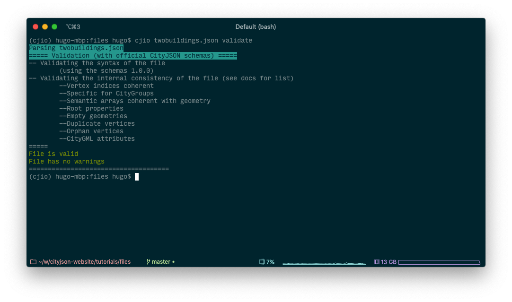

- - -

* Table of Content
{:toc}

- - -

## A client-side CityJSON validator in JavaScript

{:width="400px"}

[CityJSON schemas](https://www.cityjson.org/schemas/) allow us to verify whether a given CityJSON file is conform to the specifications.

While it's possible to get the schemas, and use a generic [JSON Schema validator](https://json-schema.org/implementations.html#validators), it's pretty tedious.

[cjio](https://github.com/cityjson/cjio) has a `validate` operator, but it should be installed.

All that to say that a web-based validator where a user can just drag'n'drop a CityJSON file and have it validated against the schemas would be useful.
Something like the [glTF validator](https://github.khronos.org/glTF-Validator/).

You'd learn about JSON Schemas, JavaScript, etc.

**Contact:** [Hugo Ledoux](https://3d.bk.tudelft.nl/hledoux)

- - -

## A CityJSON loader for ParaView

{:width="400px"}

Paraview is an open-source, multi-platform data-analysis and visualization application. It is used for the visualization of simulation results in fields such as CFD calculations.

In this research topic, your goal is to develop a loader for CityJSON files in ParaView. You will have to work in the C++ programming language and ParaView's API in order to build a respective reader.

Resources: [ParaView plugins how-to](https://www.paraview.org/Wiki/ParaView/Plugin_HowTo).

**Contact:** [Clara García-Sánchez](https://cgarcia-sanchez.com)