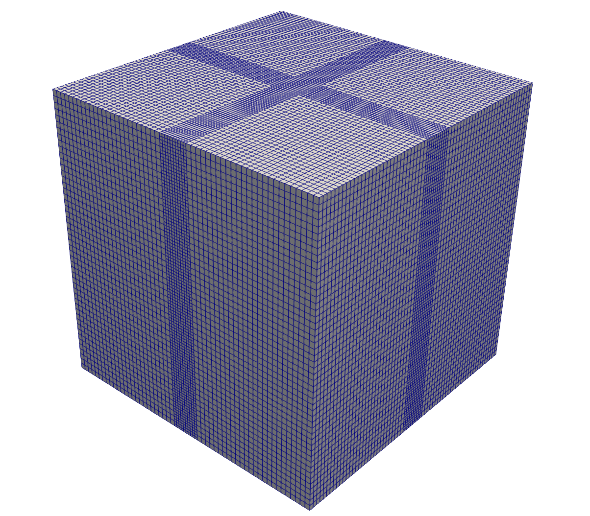
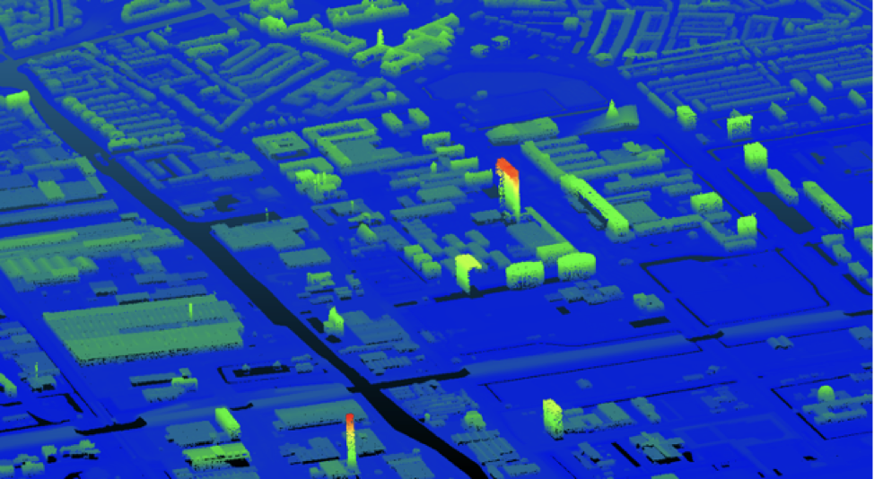

- - -

* Table of Content
{:toc}

- - -

## Add support for CityJSON in BlueSky

{:width="400px"}

[BlueSky](https://github.com/TUDelft-CNS-ATM/bluesky) is an open Air Traffic Simulator that is being actively used to perform research on Air Traffic Management and Air Traffic Flows. It would be extremely beneficial for such simulations to take advantage of 3D city models by adding support for [CityJSON](https://www.cityjson.org/) loading.

In this project you'll have to implement parsing of CityJSON for the needs of BlueSky. The tool is open source and is written in Python. There will be support from the developers of the tool in the process.

You'll improve your programming skills in the process and learn a lot about manipulating 3D geometry.

**Contact:** [Stelios Vitalis](https://3d.bk.tudelft.nl/svitalis)

## Automate generating blockMesh files for OpenFOAM

{:width="400px"}

Generating blocks for CFD meshes is quite a trivial task that still takes quite some manual effort resulting in wasted time. The assignment’s objective is to automatically generate the [OpenFOAM](https://openfoam.org/) blockMesh dictionary based on some user defined parameters (such as number of blocks, size of domain, etc.). It could be through Shell or Python, but optimally it will be an online Javascript application, similar to this [example] (https://turfjs.org).

**Contact:** [Nadine Hobeika](https://3d.bk.tudelft.nl/nhobeika)

## Tool for automatic collection and set-up of 3D point clouds

{:width="400px"}

When reconstructing automatically the geometries of urban scenarios (eg all the buildings with the terrain), the first step is to collect the necessary point clouds for the area of interest. 
This process is generally done mostly manual, which can require a few hours of work to have the optimal location extension and point cloud density. 
With this research assignment we would like to develop an (online) tool that automatically collects the desired point cloud in the Netherlands based on municipalities and/or areas of interest. 
The tool could be a Python package (and potentially use [click] (https://click.palletsprojects.com/en/8.0.x/) that fetches the AHN3 tile required from [PDOK-AHN] (https://app.pdok.nl/ahn3-downloadpage/) and could for instance filter the appropriate LAS classes and/or thin the datasets.

And online tool hosted somewehere (by using the Python framework [flask] (https://flask.palletsprojects.com/en/2.0.x/)) would be an alternative.

**Contact:** [Hugo Ledoux](https://3d.bk.tudelft.nl/hledoux/) and [Ivan Pađen](https://3d.bk.tudelft.nl/ipaden)
